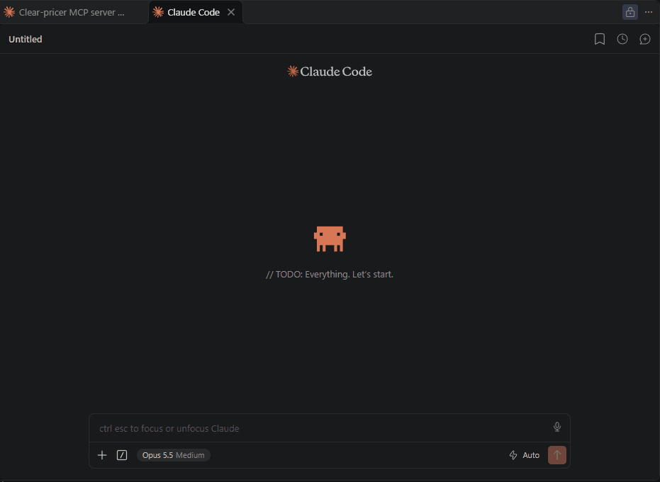

# clear-pricer-mcp

[](https://github.com/tjromack/clear-pricer-mcp/actions/workflows/ci.yml)

> © 2026 Trevor J. Romack — MIT-licensed ([LICENSE](LICENSE)) · tjromack@gmail.com

**Ask what a procedure costs at three Chicago hospitals from any MCP client, and get back rows cited to the hospital's
own price file.**

A TypeScript MCP server over the public data release of [clear-pricer](https://github.com/tjromack/clear-pricer):
CMS-mandated hospital price files and the NPPES provider registry, cleaned, reconciled and published as versioned
Parquet. Every tool is read-only, typed end to end, and returns provenance with every row: the hospital, its source
file, that file's SHA-256 and effective date, and the release tag.

> **Public data only — no PHI, no keys, no accounts, no telemetry.**

**Demonstrates:** exposing a versioned data release as typed, grain-safe MCP tools, verified by planted-bug mutations.

## Try it

```bash
claude mcp add clear-pricer -- npx -y clear-pricer-mcp
```

Then ask, for example: *"What does an established-patient office visit (99213) cost at each hospital, and why is one
missing?"*

Claude Desktop, Cursor and other clients take the same command in their MCP config:

```json
{ "mcpServers": { "clear-pricer": { "command": "npx", "args": ["-y", "clear-pricer-mcp"] } } }
```

The first question about a table downloads it once from the pinned release (every table but the 117 MB charge table
is under 3 MB) into your OS cache, verified against the release's manifest.



### Behind a corporate proxy

MCP clients start the server with a minimal environment. If your network inspects TLS, pass your CA to Node in the
server's config:

```json
{ "mcpServers": { "clear-pricer": { "command": "npx", "args": ["-y", "clear-pricer-mcp"],
  "env": { "NODE_EXTRA_CA_CERTS": "C:\\path\\to\\corporate-ca.pem" } } } }
```

## Who it's for

People who want an AI assistant to answer hospital price questions from the hospitals' own published files, with a
citation they can check rather than a number they have to trust; and engineers who want a worked example of an MCP
server that cannot quietly double-count, average across incomparable rows, or answer from data it has not verified.

## Tools

| Tool | Answers | Reads |
|---|---|---|
| `find_codes` | "knee MRI" → billing codes, from the hospitals' own descriptions; flags codes that matched on one hospital's wording only | `agg_code_prices` |
| `compare_code_prices` | One code across the hospitals, for one rate basis; names hospitals that publish it another way, and how | `agg_code_prices`, `files` |
| `get_payer_rates` | One code at one hospital, by payer and plan, each charge cited by its position in the source file | `fct_standard_charges`, `dim_charge_codes` |
| `lookup_provider` | Who an NPI was, as of a date; every version; which hospital discloses it | `dim_provider_history` (remote), `rpt_npi_resolution` |
| `data_quality` | How far to trust each hospital's file: NPI reconciliation, template deviations, quarantined rows | `rpt_*`, `files` |
| `release_info` | Which release is served, what it was built from, and each file's verification status | `manifest.json` |

A question nothing in the release can answer is an error that says what was searched and what does exist, never an
empty result.

```
99213 (CPT_CAT_I), rate basis dollar, release data-2026-10-07-67efd3d2:
- RUSH University Medical Center, outpatient: median $185.00 (range $88.00–$251.60, 15 payer plans)
  — source 362174823_rush-university-medical-center_standardcharges.csv, updated 2026-09-25
- The University of Chicago Medical Center, outpatient: median $61.65 (range $61.65–$61.65, 1 payer plan)
  — source 363488183_the-university-of-chicago-medical-center_standardcharges.json, updated 2026-04-01
Note: Northwestern Memorial Hospital publishes this code, but not under rate_basis 'dollar':
  outpatient / algorithm_only: 6 charge rows (no dollar rate); outpatient / dollar_from_percent: 276 charge rows.
```

## How it's verified

All results below are from `data-2026-10-07-67efd3d2`; [docs/results/contract-tests.md](docs/results/contract-tests.md)
is generated by the run itself.

- **Every file is verified before it is read.** The SHA-256 of the release's `manifest.json` is pinned in
  [src/release.ts](src/release.ts); the manifest pins every file; a mismatch refuses to serve (tested with tampered
  files, a corrupted cache, and a wrong pin).
- **88 tests** in four suites: unit (17), contract (46: each tool through a real MCP client over slices of the release),
  end-to-end (3), and release (22: the real release recomputed against its own `check_values.json`).
- **Grain, at full scale.** Joining charges to codes turns 7,371,416 charges into 22,647,893 rows (3.07×); the tools
  never do. `get_payer_rates`' charge selection reproduces all 49,404 `charge_rows` in `agg_code_prices` with 0
  mismatches, and covers exactly the 5,704,751 charges it summarises. Integer-cent checksums of the rate and gross
  columns match the release.
- **24 planted bugs, 24 caught.** `npm run mutate` applies each realistic bug (averaging across settings, a fanned-out
  join, closed date intervals, skipped hash checks, empty answers returned as success, …), requires it to compile,
  and runs every suite. The first run found a behaviour no test covered; it has one now.
- **Clean clone in CI** on Ubuntu and Windows, Node 20 and 22, plus the release suite and the compiled server driven
  over stdio by an MCP client.

## What this does *not* let you claim

- Not a complete or authoritative price index: three Chicago hospitals, one pinned release, the slice clear-pricer
  publishes, with its reconciliation failures stated there.
- Not a price estimate for any patient. Published negotiated rates are contract terms, not what a given person pays.
- Descriptions are the hospitals' own and can be wrong: UChicago describes CPT 44373 (small-bowel endoscopy) as a
  functional brain MRI. The tools surface such disagreements; they do not correct them.
- The NPPES provider history (563 MB) is read remotely by HTTP range, so its row count is checked against the manifest
  but it is not hash-verified like every other file.
- Not a hosted service: stdio only, running on the user's machine.

## Develop

```bash
git clone https://github.com/tjromack/clear-pricer-mcp && cd clear-pricer-mcp
npm ci && npm test        # offline, fixture-backed, a few seconds
npm run test:release      # the real pinned release against its check_values.json (~120 MB download the first time)
npm run mutate            # the 24-mutant suite; rewrites docs/results/
npm run build && npm run smoke   # the compiled server over stdio, one question per tool
```

The case study is [docs/CASE-STUDY.md](docs/CASE-STUDY.md). Design decisions and what was rejected are in
[DECISIONS.md](DECISIONS.md); the build journal is [docs/BUILD-LOG.md](docs/BUILD-LOG.md).
